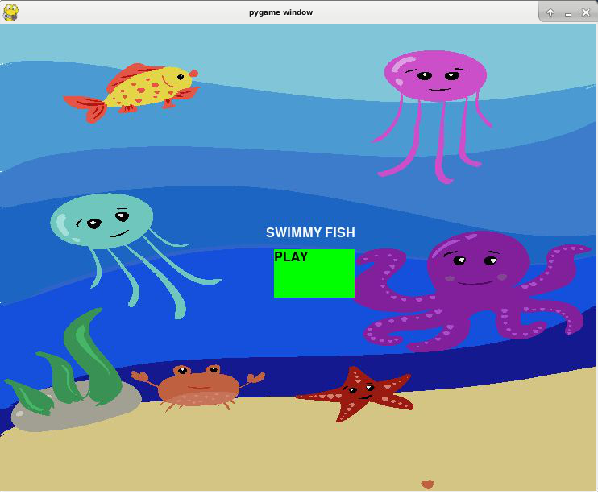

# Swimmy-Fish

## CS 110 Final Project
### Fall, 2021
### [Assignment Description](https://docs.google.com/document/d/1H4R6yLL7som1lglyXWZ04RvTp_RvRFCCBn6sqv-82ps/edit#)

https://github.com/bucs110a0fall21/final-project-stars

https://docs.google.com/presentation/d/1Kq_ayvOlxeIXe1vUbVg1ziv7GrQmxvP5btaV7wuOH3c/edit#slide=id.gca4537879_0_103 

### Team: Stars
#### Manjot Kaur, Najah Julien, Brianna Nunez

***

## Project Description *(Software Lead: Manjot Kaur)*
This project is a Flappy Bird-like game with an oceanic twist in which the player clicks on the screen in order to move the fish through the sharks. As the fish moves through the sharks, the player's score goes up. If the fish falls off the screen or touches one of the sharks, the game is over. 

***    

## User Interface Design *(Front End Specialist: Najah Julien)*

	 
* Screen 1: The title screen appears with the game title and the start button centered on the screen. When the start button is clicked, it changes to screen 2.
* Screen 2: The game screen appears with the player character and the obstacles. The screen scrolls to the left as the character avoids the obstacles. An accumulator is used to keep score and the score is displayed in the upper right corner of the screen.A text file is also used to keep track of the high score. 
* Screen 3: The game over screen appears when the player character hits an obstacle. A start over button and a quit button also appear. When the start over button is clicked, it takes you to screen 2. When the quit button is clicked, it takes you to screen 1.
* 
  
  
  
  
  

***        

## Program Design *(Backend Specialist: Manjot Kaur & Najah Julien)*
* Non-Standard libraries
    * pygame: https://www.pygame.org/docs/ , pygame used to create games in python;
      random: https://docs.python.org/3/library/random.html , used to select random numbers;
      sys: https://docs.python.org/3/library/sys.html , used with operating system, used sys.exit() to exit game; 
      time: https://docs.python.org/3/library/time.html , used to get, set, use time, used to generate sharks after a certain period of time
 
* Class Interface Design

         

* Classes
    * button.py: creates a button; 
      start.py: uses button class to create a "start button" on the start screen;
      gameover.py: uses button class to create "quit" and "play again" buttons on game over screen;
      score.py: keeps track of player's score;
      fish.py: player;
      shark.py: bottom shark;
      sharktwo.py: top shark;
      controller.py: sets state of game and runs according to state set 

## Project Structure *(Software Lead)*

The Project is broken down into the following file structure:
* main.py
* bin
    * src:
	button.py,
	controller.py,
	fish.py,
	gameover.py,
	score.py,
	shark.py,
	sharktwo.py,
	start.py
* assets
    * OriginalGUI.jpg,
      Swimmy Fish Game Over Screen.png,
      Swimmy Fish Game Screen.png,
      Swimmy Fish Home Button Hover.png,
      Swimmy Fish Home.png,
      Swimmy Fish Play Again Hover.png,
      Swimmy Fish Quit Hover.png,
      Water Drop 1.mp3,
      classStructure.png,
      class_diagram.jpg,
      highscore.txt,
      swimmyfish background.png,
      swimmyfish downshark.png,
      swimmyfish fish.png,
      swimmyfish upshark4.png,
* etc
    * cs110 final presentation.mp4

***

## Tasks and Responsibilities *(Software Lead: Manjot Kaur)*

### Software Lead: Manjot Kaur

Made sure group had weekly meetings and each member's responsibilities for that week were outlined. Communicated issues in code and possible solutions. Wrote ATP. Drew images in game (fish, sharks, background). Created class structure. In charge of shark.py, sharktwo.py, fish.py, score.py, controller.py. 

### Front End Specialist: Najah Julien

Created GUI. In charge of button.py, start.py, gameover.py, controller.py.

### Back End Specialist: Brianna Nunez

 The back end specialist did not do work on this project. Back end work done by software lead and front end specialist. 

## Testing *(Software Lead: Manjot Kaur)*
* The testing strategy for this project was largely just looking to see what was happening on the screen and if it looked right or wrong. If it looked right, the code was right and we could move on. If the stuff on the screen did not look right, the code had to be edited. 
    * Example: When generating sharks, we ran into issues of shark size, distance from other sharks, and overlap. Fixing the shark size and distance was mostly guess & check using math & logic to get the sharks to look right. However, there was was still a problem of the first sharks that showed up overlapping each other. So, we had to write code that said if the sharks overlapped, they had to be killed. This fixed that problem and the game screen then looked like what we wanted it to look like. 

* ATP:

| Step                  | Procedure     | Expected Results  | Actual Results |
| ----------------------|:-------------:| -----------------:| -------------- |
|  1  | Run Controller()  | Title Screen opens normally and is functional  |          |
|  2  | Hover over "Play" button | Color becomes lighter |
|  3  | Hover over "Quit button | Color becomes lighter |
|  4  | Hover over "Play Again" button | Color becomes lighter |
|  5  | Click "Play" button | Game Screen opens normally |                 |
|  6  | Click "Quit" button | Title Screen opens normally and is functional |
|  7  | Click "Play Again" button | Game Screen opens normally |
|  8  | Press Up Arrow | Moves fish up 1 unit |
|  9  | Fish pass through Sharks | Score goes up by one; Sound of water droplet plays |
|  10 | Fish hit shark | Game Over screen opens | 
|  11 | | |
